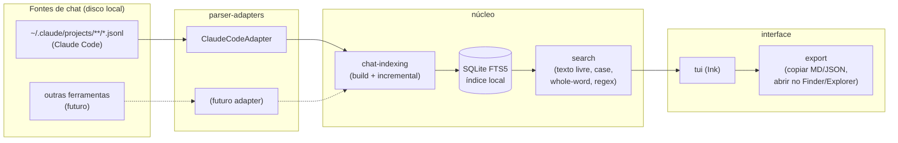

# Arquitetura

Mapa de alto nível do `claude-chat-finder` para quem for contribuir. A fonte da verdade detalhada — requirements testáveis e o raciocínio por trás de cada decisão — vive no OpenSpec: [`openspec/specs/`](openspec/specs/) (specs ativas, após archive) e [`openspec/changes/bootstrap-mvp/design.md`](openspec/changes/bootstrap-mvp/design.md) (decisões desta primeira leva de trabalho). Este documento é só o resumo estável pra orientar quem está lendo o código pela primeira vez.

## Visão geral



Fluxo: cada **adapter** lê uma fonte de chats e devolve sessões no formato normalizado. O **indexador** consome sessões de todos os adapters registrados e mantém um banco **SQLite FTS5** local atualizado incrementalmente. A **busca** consulta esse índice aplicando os modificadores (case sensitive, whole word, regex). A **TUI** (Ink) é a única consumidora da busca em tempo real, e delega ações de **export** (copiar, abrir arquivo) sobre a sessão selecionada.

## Módulos

| Módulo | Capability (OpenSpec) | Responsabilidade |
|---|---|---|
| `src/adapters/` | [`parser-adapters`](openspec/changes/bootstrap-mvp/specs/parser-adapters/spec.md) | Interface `ChatAdapter` + implementação `ClaudeCodeAdapter` |
| `src/indexing/` | [`chat-indexing`](openspec/changes/bootstrap-mvp/specs/chat-indexing/spec.md) | Schema do SQLite FTS5, build inicial, re-index incremental por mtime, poda de sessões removidas |
| `src/search/` | [`search`](openspec/changes/bootstrap-mvp/specs/search/spec.md) | Query engine sobre o índice: texto livre, ranking, case/whole-word/regex |
| `src/tui/` | [`tui`](openspec/changes/bootstrap-mvp/specs/tui/spec.md) | Componentes Ink: input de busca, lista de resultados, preview em Markdown |
| `src/export/` | [`export`](openspec/changes/bootstrap-mvp/specs/export/spec.md) | Copiar para clipboard (MD/JSON), abrir arquivo no file manager do SO |
| `src/cli.ts` | — | Entry point: inicializa adapters, roda indexação, sobe a TUI |

Nenhum módulo de UI ou busca conhece o formato bruto de um adapter específico — todos falam apenas o modelo normalizado (`Session` / `Message`) definido em `src/adapters/types.ts`.

## Contrato do adapter

```ts
interface ChatAdapter {
  id: string;
  discover(rootDir?: string): Promise<Session[]>;
}

interface Session {
  id: string;
  source: string;        // id do adapter que produziu esta sessão
  projectPath: string;    // path real do projeto, lido do próprio conteúdo do evento — nunca decodificado do nome da pasta
  filePath: string;       // arquivo de origem no disco
  mtimeMs: number;
  messages: Message[];
}

interface Message {
  role: "user" | "assistant" | "tool";
  content: string;
  timestamp: string;
}
```

**Gotcha importante**: o Claude Code sanitiza o path do projeto no nome da pasta trocando `/` por `-` (ex.: `/Users/x/my-app` vira `-Users-x-my-app`). Essa transformação é **ambígua** — um path com hífen literal não pode ser reconstruído de volta com segurança. Por isso o `ClaudeCodeAdapter` sempre lê o path real do campo `cwd` presente em cada evento do próprio JSONL, nunca decodificando o nome do diretório.

## Índice (SQLite FTS5)

- Uma tabela de sessões (metadados: `filePath`, `mtimeMs`, `projectPath`, `source`) e uma tabela virtual FTS5 para o conteúdo das mensagens.
- Re-index é incremental: só arquivos com `mtimeMs` diferente do valor gravado são reprocessados; sessões cujo arquivo sumiu do disco são removidas do índice.
- Fica em um diretório de config/cache por SO — ver [Configuração no README](README.md#configuração). Resolução de path por plataforma deve usar uma lib estabelecida, não lógica própria (ver Open Questions em `design.md`).

## Build e distribuição

CI (GitHub Actions) roda `bun build --compile` numa matriz macOS/Linux/Windows e publica os binários resultantes como assets de uma GitHub Release taggeada. Não há publish no npm no caminho de instalação do usuário final — `bun install` só é necessário pra quem for contribuir com o código-fonte.

## Por que este desenho

O raciocínio completo (alternativas consideradas, riscos, trade-offs) está em [`design.md`](openspec/changes/bootstrap-mvp/design.md). Resumo:

- **Bun + TypeScript**: aproveita a experiência já existente com JS/TS e dá `bun:sqlite` + `bun build --compile` "de graça" — binário único sem runtime externo.
- **Ink**: TUI com componentes ao estilo React, mesma linguagem mental do resto do ecossistema JS/TS.
- **SQLite FTS5** em vez de scan on-the-fly: histórico cresce, e um índice invertido é o jeito certo de manter busca instantânea — "busca binária" não se aplica a full-text search porque exige dados ordenados.
- **Adapters desde o início**: evita reescrever indexação/busca/TUI se um adapter para outra ferramenta (Cursor, Aider, Codex CLI, etc.) for adicionado depois.
