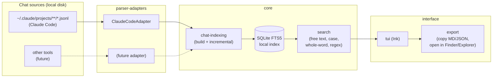

# Architecture

High-level map of `claude-chat-finder` for contributors. The detailed source of truth — testable requirements and the reasoning behind each decision — lives in OpenSpec: [`openspec/specs/`](openspec/specs/) (active specs, once archived) and [`openspec/changes/bootstrap-mvp/design.md`](openspec/changes/bootstrap-mvp/design.md) (decisions from this first batch of work). This document is just the stable summary for anyone reading the code for the first time.

## Overview



Flow: each **adapter** reads one chat source and returns sessions in the normalized format. The **indexer** consumes sessions from every registered adapter and keeps a local **SQLite FTS5** database incrementally up to date. **Search** queries that index, applying the modifiers (case sensitive, whole word, regex). The **TUI** (Ink) is the sole real-time consumer of search, and delegates **export** actions (copy, open file) on the selected session.

## Modules

| Module | Capability (OpenSpec) | Responsibility |
|---|---|---|
| `src/adapters/` | [`parser-adapters`](openspec/changes/bootstrap-mvp/specs/parser-adapters/spec.md) | `ChatAdapter` interface + `ClaudeCodeAdapter` implementation |
| `src/indexing/` | [`chat-indexing`](openspec/changes/bootstrap-mvp/specs/chat-indexing/spec.md) | SQLite FTS5 schema, initial build, incremental re-index by mtime, pruning of removed sessions |
| `src/search/` | [`search`](openspec/changes/bootstrap-mvp/specs/search/spec.md) | Query engine over the index: free text, ranking, case/whole-word/regex |
| `src/tui/` | [`tui`](openspec/changes/bootstrap-mvp/specs/tui/spec.md) | Ink components: search input, result list, Markdown preview |
| `src/export/` | [`export`](openspec/changes/bootstrap-mvp/specs/export/spec.md) | Copy to clipboard (MD/JSON), open the file in the OS's file manager |
| `src/cli.ts` | — | Entry point: initializes adapters, runs indexing, launches the TUI |

No UI or search module knows the raw format of any specific adapter — they all speak only the normalized model (`Session` / `Message`) defined in `src/adapters/types.ts`.

## Adapter contract

```ts
interface ChatAdapter {
  id: string;
  discover(rootDir?: string): Promise<Session[]>;
}

interface Session {
  id: string;
  source: string;        // id of the adapter that produced this session
  projectPath: string;    // the project's real path, read from the event content itself — never decoded from the folder name
  filePath: string;       // source file on disk
  mtimeMs: number;
  messages: Message[];
}

interface Message {
  role: "user" | "assistant" | "tool";
  content: string;
  timestamp: string;
}
```

**Important gotcha**: Claude Code sanitizes the project path in the folder name by replacing `/` with `-` (e.g., `/Users/x/my-app` becomes `-Users-x-my-app`). This transformation is **ambiguous** — a path with a literal hyphen cannot be safely reconstructed from it. That's why `ClaudeCodeAdapter` always reads the real path from the `cwd` field present in each JSONL event itself, never by decoding the directory name.

## Index (SQLite FTS5)

- One sessions table (metadata: `filePath`, `mtimeMs`, `projectPath`, `source`) and one FTS5 virtual table for message content.
- Re-indexing is incremental: only files whose `mtimeMs` differs from the stored value are reprocessed; sessions whose file has vanished from disk are removed from the index.
- Lives in a per-OS config/cache directory — see [Configuration in the README](README.md#configuration). Per-platform path resolution is hand-rolled in `src/indexing/paths.ts` rather than delegated to a library: `resolveIndexDbPath(home, platform, env)` takes the platform as a parameter, so each OS's convention is assertable from any test host. A library like `env-paths` always joins through the *live* host's `node:path`, which makes exact Windows-style output untestable from macOS/Linux CI. The conventions themselves are the standard ones (XDG on Linux, `Application Support` on macOS, `%LOCALAPPDATA%` on Windows) — only the path-joining is inline. See the resolved Open Question in `design.md`.

## TUI (Ink)

`src/cli.tsx` opens the index, then renders `src/tui/app.tsx` into the terminal's **alternate screen** (like `vim` or `less`, so the user's scrollback survives). Indexing runs *after* the first paint — a full build takes over a second on a real history, which is too long to stare at a blank terminal for — and the header reports its progress.

The pieces are split so that everything except the actual drawing is a pure function, and therefore unit-testable without a terminal:

| File | Responsibility |
|---|---|
| `tui/app.tsx` | State and key handling: query, match mode, selection, scroll, debounced search |
| `tui/components/` | Drawing only: search field, result list, preview pane, Markdown lines |
| `tui/markdown.ts` | Markdown → styled display lines, pre-wrapped to a width |
| `tui/input-state.ts` | The query field as a reducer (`applyEdit(state, input, key)`) |
| `tui/viewport.ts` | Selection clamping and which slice of a list/preview is visible |
| `tui/transcript.ts` | An indexed session → the Markdown shown in the preview |
| `tui/console.ts` | Holds back `console.*` output while the TUI owns the screen |

Two consequences worth knowing:

- **Markdown is rendered by a ~200-line module, not a library.** It emits styled spans per display line rather than a string, which is what lets the preview scroll by slicing lines, and makes the exact output assertable in tests. Same reasoning as `indexing/paths.ts`: a small, precisely testable surface beats a dependency.
- **The preview never shows tool calls.** The adapter only extracts `text` blocks (see [Adapter contract](#adapter-contract)), so a turn made entirely of tool calls has no content — those messages are skipped instead of drawn as an empty heading.

## Build and distribution

CI (GitHub Actions) runs `bun build --compile` across a macOS/Linux/Windows matrix and publishes the resulting binaries as assets on a tagged GitHub Release. There's no npm publish in the end-user install path — `bun install` is only needed for contributors working on the source.

## Why this design

The full reasoning (alternatives considered, risks, trade-offs) is in [`design.md`](openspec/changes/bootstrap-mvp/design.md). Summary:

- **Bun + TypeScript**: builds on existing JS/TS experience and gets `bun:sqlite` + `bun build --compile` "for free" — a single binary with no external runtime.
- **Ink**: a TUI with React-style components, the same mental model as the rest of the JS/TS ecosystem.
- **SQLite FTS5** instead of on-the-fly scanning: history grows over time, and an inverted index is the right way to keep search instant — "binary search" doesn't apply to full-text search because it requires sorted data.
- **Adapters from day one**: avoids rewriting indexing/search/TUI if an adapter for another tool (Cursor, Aider, Codex CLI, etc.) is added later.
